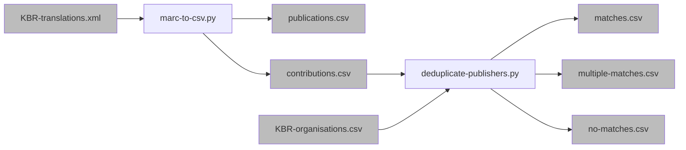

# Data Quality

The automatic processing of different data sources on the one hand, and automatic comparison with integrated data sources on the other hand reveals data quality issues.
In the following we describe which quality issues we can detect and how we provide those to a librarian which can semi-automatically fix the issues.

## Example

We do this by following a structured approach with different quality dimensions and metrics (with unique identifiers):
For example, we have 

* the **category** `2: several links from an authority name to an authority record`
   * with the **more specific issue** `kbr2: 264 field name several authority candidates`
   * for which several **root causes** are described 
      * `rootCause17: the authority name of MARC field 264 has a single match with one of the candidate authority records from KBR`
      * `rootCause18: the authority name of MARC field 264 has no match with any of the KBR candidate authority records`).

For each root cause a strategy is described to fix it, e.g. a series of manual steps which have to be performed.
To support this, for each root cause a (slightly different) CSV might be provided to show relevant metadata supporting the decision making.

Because the quality dimensions and possible root causes are described in CSV files with identifiers, we can map those also to RDF by using vocabularies such as the [W3C Data Quality Vocabulary](https://w3.org/TR/vocab-dqv/).

## KBR publisher identification

We identified the issues `kbr1` and `kbr2`. As seen in the following graph, we create several CSV files when trying to identify publishers.
All of them need to be checked, but more information besides the CSV content is needed to determine the precise issue and root-cause.

## KBR invalid ISBN

Todo

## Conflicting dates

Todo

## Duplicate identifier

Todo
